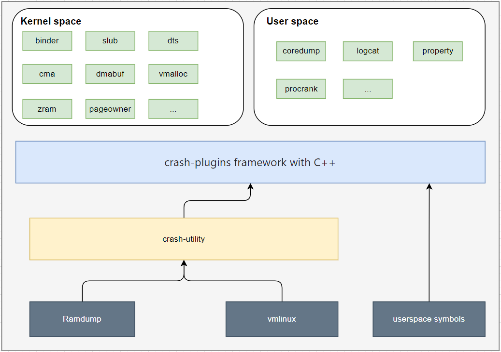

# Crash Utility Plugins

A comprehensive collection of crash-utility plugins for analyzing Linux kernel crash dumps, covering both kernel space and user space debugging. These plugins significantly improve debugging efficiency for Qualcomm platforms.



## Table of Contents

- [Features](#features)
- [Prerequisites](#prerequisites)
- [Building](#building)
- [Installation](#installation)
- [Supported Modules](#supported-modules)
- [Usage](#usage)
- [Development Guide](#development-guide)
- [Tested Kernels](#tested-kernels)
- [Contributing](#contributing)
- [License](#license)

## Features

- **Comprehensive Coverage**: 40+ plugins covering memory, process, device, and system analysis
- **Dual Architecture Support**: ARM64 and ARM32 platforms
- **Flexible Build System**: Single-module or multi-module compilation
- **Android Integration**: Special support for Android 11+ (API level 30+)
- **Kernel Version Support**: Tested on kernels 5.4 to 6.6

## Prerequisites

### System Requirements

- CMake >= 3.21.1
- GCC with multilib support
- Linux development environment

### Install Dependencies

```bash
# Install CMake
sudo apt-get install cmake

# Enable 32-bit architecture support
sudo dpkg --add-architecture i386
sudo apt-get update

# Install required libraries
sudo apt-get install gcc-multilib g++-multilib \
    libzstd-dev libzstd-dev:i386 \
    libelf-dev libelf-dev:i386 \
    libsystemd-dev libsystemd-dev:i386 \
    pkg-config
```

## Building

### Build Configuration

The build system supports two modes:

1. **Single-module mode** (default): All plugins compiled into one `plugins.so`
2. **Multi-module mode**: Each plugin compiled as a separate `.so` file

### Single-Module Build (Recommended)

```bash
cmake -DCMAKE_C_COMPILER="/usr/bin/gcc" \
      -DCMAKE_CXX_COMPILER="/usr/bin/g++" \
      -DCMAKE_BUILD_TYPE="Debug" \
      -DCMAKE_BUILD_TARGET_ARCH="arm64" \
      -DBUILD_TARGET_TOGETHER="1" \
      -B output/arm64

cmake --build output/arm64
```

### Multi-Module Build

```bash
cmake -DCMAKE_C_COMPILER="/usr/bin/gcc" \
      -DCMAKE_CXX_COMPILER="/usr/bin/g++" \
      -DCMAKE_BUILD_TYPE="Debug" \
      -DCMAKE_BUILD_TARGET_ARCH="arm64" \
      -B output/arm64

cmake --build output/arm64
```

### Quick Build Script

```bash
./build.sh
```

## Installation

Load plugins into a running crash-8.0.6+ session:

```bash
# Single-module mode
crash> extend <path-to>/output/arm64/plugins.so

# Multi-module mode
crash> extend <path-to>/output/arm64/binder.so
crash> extend <path-to>/output/arm64/slub.so
```

## Supported Modules

### Kernel Space Modules

| Module | ARM64 | ARM32 | Description |
|--------|-------|-------|-------------|
| **Memory Management** |||
| slub | ✓ | ✓ | SLUB allocator analysis (info/poison/trace) |
| buddy | ✓ | ✓ | Buddy system memory analysis |
| cma | ✓ | ✓ | CMA memory regions |
| memblock | ✓ | ✓ | Early boot memory allocator |
| vmalloc | ✓ | ✓ | Vmalloc memory regions |
| reserved | ✓ | ✓ | Reserved memory regions |
| zram | ✓ | ✓ | ZRAM compression analysis |
| swap | ✓ | ✓ | Swap space analysis |
| dmabuf | ✓ | ✓ | DMA-BUF memory tracking |
| pageowner | ✓ | ✓ | Page allocation tracking |
| pagecache | ✓ | ✓ | Page cache analysis |
| meminfo | ✓ | ✓ | Memory statistics |
| **Process & Scheduling** |||
| procrank | ✓ | ✓ | Process memory ranking (VSS/RSS/PSS/USS) |
| sched | ✓ | ✓ | Task scheduling information |
| binder | ✓ | ✓ | Binder IPC analysis |
| lmkd | ✓ | ✓ | Low Memory Killer Daemon |
| **Device & Drivers** |||
| dd | ✓ | ✓ | Device driver enumeration |
| dts | ✓ | ✓ | Device tree parsing |
| regulator | ✓ | ✓ | Voltage regulator info |
| icc | ✓ | ✓ | Interconnect analysis |
| ccf | ✓ | ✓ | Common Clock Framework |
| thermal | ✓ | ✓ | Thermal zone monitoring |
| cpu | ✓ | ✓ | CPU frequency and policy |
| watchdog | ✓ | ✓ | Watchdog timer status |
| **Debugging & Logging** |||
| rtb | ✓ | ✓ | Register trace buffer |
| pstore | ✓ | ✓ | Persistent storage logs |
| qlog | ✓ | ✓ | PMIC and boot logs |
| ipc | ✓ | ✓ | IPC logging framework |
| debugimage | ✓ | ✓ | Debug image parser |
| ftrace | ✓ | ✗ | Ftrace event analysis |
| systemd | ✓ | ✓ | Systemd journal logs |
| **Utilities** |||
| workqueue | ✓ | ✓ | Workqueue analysis |
| partition | ✓ | ✓ | Filesystem partitions |
| coredump | ✓ | ✓ | Process coredump generation |
| sysinfo | ✓ | ✓ | System information |
| t32 | ✓ | ✓ | T32 debugger script generation |
| lockdep | ✓ | ✗ | Lockdep detection |
| iommu | ✓ | ✓ | print iommu information |

### Android Userspace Modules

| Module | Android 11 | Android 12+ | Description |
|--------|------------|-------------|-------------|
| property | ✓ | ✓ | System properties |
| logcat | ✓ | ✓ | Logcat buffer analysis |
| surfaceflinger | ✓ | ✓ | Graphics layer info |

## Usage

Detailed usage examples are available in [USAGE.md](USAGE.md).

### Quick Examples

```bash
# Display all binder processes
crash> binder -a

# Show memory statistics
crash> meminfo -a

# Analyze SLUB cache
crash> slub -a

# Generate process coredump
crash> coredump -p 1234

# Parse device tree
crash> dts -a

# View thermal zones
crash> tm -d
```

For comprehensive command documentation, see:
```bash
crash> help <command>
```

## Development Guide

### Adding a New Plugin (Single-Module Mode)

1. **Create header file** (`demo/demo.h`):

```cpp
/**
 * Copyright (c) Qualcomm Technologies, Inc. and/or its subsidiaries.
 * SPDX-License-Identifier: GPL-2.0-only
 */

#ifndef DEMO_H_
#define DEMO_H_

#include "plugin.h"

class Demo: public ParserPlugin {
public:
    Demo();
    void cmd_main(void) override;
    void init_offset(void) override;
    void init_command(void) override;
    DEFINE_PLUGIN_INSTANCE(Demo)
};

#endif // DEMO_H_
```

2. **Implement plugin** (`demo/demo.cpp`):

```cpp
#include "demo.h"

#pragma GCC diagnostic push
#pragma GCC diagnostic ignored "-Wpointer-arith"

void Demo::cmd_main(void) {
    int c;
    if (argcnt < 2) cmd_usage(pc->curcmd, SYNOPSIS);

    while ((c = getopt(argcnt, args, "a")) != EOF) {
        switch(c) {
            case 'a':
                // Your implementation
                break;
            default:
                argerrs++;
                break;
        }
    }

    if (argerrs)
        cmd_usage(pc->curcmd, SYNOPSIS);
}

void Demo::init_command(void) {
    cmd_name = "demo";
    help_str_list = {
        "demo",
        "your description",
        "demo -a",
        "  -a  show all information",
        NULL
    };
}

void Demo::init_offset(void) {
    // Initialize structure offsets if needed
}

#pragma GCC diagnostic pop
```

3. **Register plugin** in `plugins.cpp`:

```cpp
#include "demo/demo.h"

// Add instance declaration
std::shared_ptr<Demo> Demo::instance = nullptr;

// Register in plugin_init()
void plugin_init(void) {
    plugins.push_back(make_and_init<Demo>());
    // ... other plugins
}
```

4. **Update CMakeLists.txt**:

```cmake
list(APPEND PLUGIN_SOURCES
    demo/demo.cpp)
```

### Adding a New Plugin (Multi-Module Mode)

Follow steps 1-2 above, then:

3. **Use macro in cpp file**:

```cpp
DEFINE_PLUGIN_COMMAND(Demo)
```

4. **Add build rule in CMakeLists.txt**:

```cmake
add_plugin(demo
    demo/demo.cpp)
```

### Best Practices

- Use `MEMBER_OFFSET_INIT()` for structure field offsets
- Handle both ARM64 and ARM32 architectures when applicable
- Add comprehensive help text in `init_command()`
- Use `cmd_usage()` for error handling
- Follow existing code style and patterns

## Tested Kernels

- Linux kernel versions: 5.4 to 6.6
- Android versions: 11 (API 30) to 14 (API 34)
- Architectures: ARM64, ARM32

## Contributing

Contributions are welcome! Please see [CONTRIBUTING.md](CONTRIBUTING.md) and [CODE-OF-CONDUCT.md](CODE-OF-CONDUCT.md).

## Related Links

- [Crash Utility Official Site](https://crash-utility.github.io/)

## Author

- quic_wya@quicinc.com

## License

This project is licensed under the [GPL v2 License](https://www.gnu.org/licenses/old-licenses/gpl-2.0.en.html). See [LICENSE.txt](LICENSE.txt) for the full license text.

---

**Note**: This plugin collection is designed for debugging and analysis purposes. Always ensure you have proper authorization before analyzing system crash dumps.
